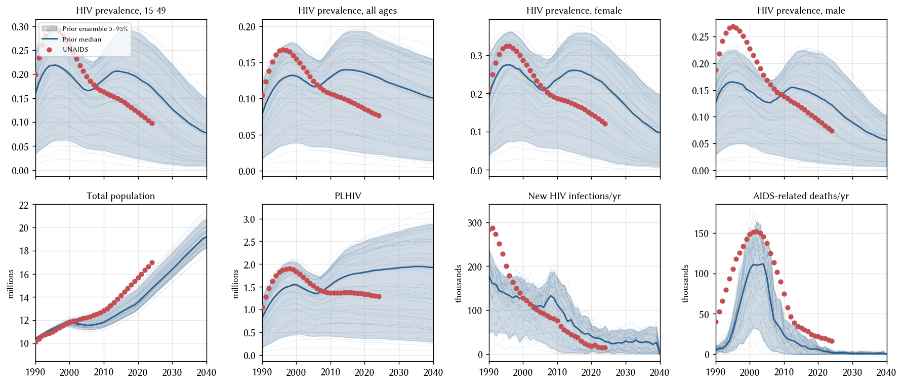
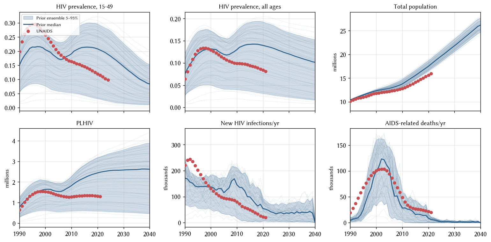
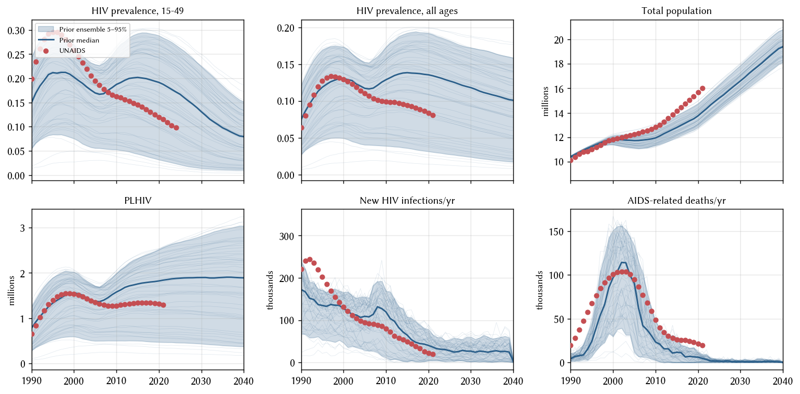

# Exp 01 — Prior-predictive coverage check

**Date:** 2026-07-14.

**Question.** With hivsim_zim on starsim main + stisim 1.5.10, and with
two new priors added (`hiv.dur_on_art`, `migration.rel_migration`), does
the prior predictive envelope bracket UNAIDS 2025 Zimbabwe surveillance
— including whole-pop `n_alive` as a new target?

**Result.** HIV metrics cover cleanly. Population `n_alive` misses at
the endpoints (2015 target 14.15 M vs ensemble p95 13.84 M;
2020 target 15.67 M vs p95 14.80 M — ~6% undershoot). The
`hiv.new_deaths` panel systematically undershoots (2020 target 22 k
vs p95 10 k). Next experiment widens `migration.rel_migration`
below 0.5 and lifts the upper `hiv.beta_m2f` bound to push those
endpoints back inside the band.

## Setup

- **Env.** New conda env `hivsim`, cloned from `starsim`; both
  `starsim` (main) and `stisim` (1.5.10) reinstalled in editable mode
  from local checkouts.
- **Priors.** 7 total; the 5 inherited from sti_notification exp 06 plus:
  - `hiv.dur_on_art ∈ [2, 10]` yr (mean of the LogN duration; controls
    post-ART churn).
  - `migration.rel_migration ∈ [0.5, 1.2]` (scale factor on the
    UN-WPP-derived migration table; 1.0 = data as-is, 0.5 = half
    emigration = more population retained).
- **Targets.** `data/zimbabwe_hiv_calib.csv`, UNAIDS 2025 vintage,
  reshaped to dot-notation columns (auto-registers with `sti.Calibration`
  via `ss.validate_sim_data`). Adds `hiv.prevalence_f`, `hiv.prevalence_m`
  compared to the previous file, and a derived `n_alive` column
  (`hiv.n_infected / hiv.prevalence`).
- **Sampling.** 50 LHS draws (scipy `qmc.LatinHypercube`, seed 45),
  one sim seed per draw, 10 000 agents, 1985–2040.
- **Extraction.** `sim.results.annualize()` for correct per-Result
  aggregation (`new_* → sum`, `n_* → mean`) — no manual groupby.

## Runs

Three configurations, saved under `outputs/` and `figures/` with a
per-run tag suffix (`nomig`, `mig`, `mig_v2`):

| tag | migration | targets |
|---|---|---|
| `nomig` | off | 2025 UNAIDS |
| `mig` | on | 2025 UNAIDS (initial 6-prior version) |
| `mig_v2` | on | 2025 UNAIDS, 7 priors (adds `migration.rel_migration`) |

`mig_v2` is the canonical run; the others are diagnostics.

## Observations

### 1. HIV metrics cover cleanly under the 7-prior + 2025-CSV setup

Ensemble 5-95% envelope brackets every UNAIDS target for `hiv.n_infected`,
`hiv.prevalence_15_49`, and `hiv.prevalence_f` at 1990/2000/2010/2015/2020.
`hiv.prevalence_m` covers 4/5 (2000 target 23% vs p95 20% — marginal
miss, sex asymmetry underrepresented at epidemic peak). `hiv.new_infections`
covers 4/5 (1990 target 283 k vs p95 238 k — small miss).

### 2. n_alive: migration matters and the direction is right, but the current bound leaves a ~6% gap in 2020

Migration OFF: `n_alive` overshoots by +12% at 2020 (17.5 M vs 15.7 M
target).
Migration ON with `rel_migration ∈ [0.5, 1.2]`: undershoots by −6%
at 2020 (14.8 M p95 vs 15.7 M).

That says the sign of the migration effect is right — it does pull the
trajectory toward reality — but even at the smallest allowed
`rel_migration=0.5` the sim isn't retaining enough people. The 2020
target sits 6% above the ensemble upper edge. Widening the lower
bound (e.g. to 0.2 or 0.3) should close it.

**Migration OFF baseline:**

**Migration ON, 6-prior initial version (pre `rel_migration`):**

### 3. hiv.new_deaths runs low across the whole trajectory except the 2000 peak

Ensemble p95 for AIDS-related deaths per year sits below the UNAIDS
target in 1990 (11 k vs 40 k), 2010 (43 k vs 75 k), 2015 (24 k vs 33 k),
and 2020 (10 k vs 22 k). Only 2000 (peak epidemic) covers cleanly.
Possible causes:

- Definition mismatch: UNAIDS "AIDS-related deaths" includes late-stage
  co-mortality (TB, opportunistic infections) that `hiv.new_deaths` may
  not count.
- Natural-history mismatch: CD4 decline / dur-untreated calibration lets
  agents survive longer than the UNAIDS estimates imply.
- Post-ART mortality: even after the stisim post-ART state fix landed
  (rc1.5.10), the CD4-postart decline slope may be too slow.

Not a coverage-check-fixable issue via prior widening alone; parking
this as a structural note for a later diagnostic.

### 4. 1990 all-ages prev target moved from 6.4% to 10.4% in the 2025 CSV, resolving the earlier triangulation gap

The previous CSV had `hiv.prevalence=0.064`, `hiv.n_infected=0.65M`,
`hiv.prevalence_15_49=0.199` — three numbers that only reconcile if
the 15-49 population share is ≤ 32%, which contradicts the demographic
reality (~45% for Zimbabwe 1990). The 2025 CSV has
`hiv.prevalence=0.104`, `hiv.n_infected=1.055M`,
`hiv.prevalence_15_49=0.199` — implying 15-49 pop share ~52%, much
closer to the real value. The three-column story now hangs together.

### 5. `Results.annualize()` is the right idiom

Initial hand-rolled `groupby(year).mean()` collapsed flow counts
incorrectly (10× low incidence). Switched to `sim.results.annualize()`
which uses each `Result`'s `summarize_by` metadata (or the
`new_* → sum`, `n_* → mean`, `cum_* → last` heuristic). Coded as a
`feedback` memory.

## Next

Two things need to move to close coverage:

1. **Widen `migration.rel_migration` bound below 0.5** so the ensemble
   can reach the 2020 `n_alive = 15.67 M` target from below.
2. **Lift the upper `hiv.beta_m2f` bound** slightly so the ensemble
   p95 covers the 1990 `hiv.new_infections = 283 k` target and the
   2000 `hiv.prevalence_m = 23%` target — both are marginal upper-edge
   misses that a slightly higher β can close.

Opening `experiments/exp_02_wider_migration_higher_beta/` with those
two prior changes and re-running the same coverage check.

## Artifacts

- `outputs/coverage_check_mig_v2.parquet` — canonical run (50 draws × 56
  years, 8 result columns, 7 priors, migration on, 2025 targets).
- `outputs/coverage_check_mig.parquet` — migration-on, 6 priors
  (pre-`rel_migration`).
- `outputs/coverage_check_nomig.parquet` — migration-off baseline.
- `outputs/coverage_draws.csv` — the 50-row LHS design (draw_idx +
  parameter values).
- `figures/coverage_check_mig_v2.png` — main figure.
- `figures/coverage_check_mig.png`, `coverage_check_nomig.png` —
  diagnostic comparators.
- `run.py` — the runner script snapshotted at experiment close.
