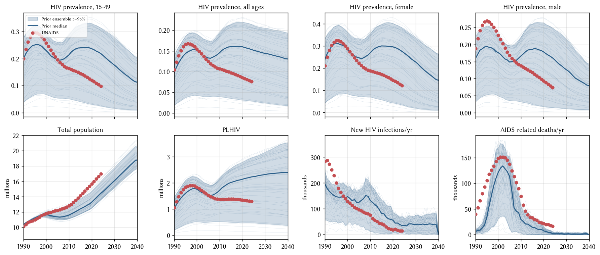

# Exp 02 — Wider migration bound + slightly higher beta upper

**Date:** 2026-07-14.

**Question.** Does widening `migration.rel_migration` from [0.5, 1.2] to
[0.2, 1.2], and lifting `hiv.beta_m2f` upper from 0.03 to 0.04, close
exp_01's marginal coverage misses on 2020 `n_alive`, 1990
`hiv.new_infections`, and 2000 `hiv.prevalence_m`?

**Result.** The beta widening fixed the male-prevalence miss at 2000
(p95 20% → 23%, matches target). The migration widening did essentially
nothing — 2020 n_alive p95 barely moved (14.80 M → 14.76 M) even
though the prior floor dropped from 0.5 → 0.2. Correlation between
per-draw `rel_migration` and 2020 n_alive is **+0.09**, i.e.
statistically absent — and if anything runs in the wrong direction
(draws with the *lowest* rel_migration have some of the lowest 2020
populations). `rel_migration` as a calibration lever is not paying
its way.

## Scorecard vs exp_01

| year | metric | target | exp_01 p05-p95 | exp_02 p05-p95 |
|---|---|---:|---|---|
| 1990 | n_alive (M) | 10.11 | [10.29, 10.49] | [10.29, 10.48] |
| 2015 | n_alive (M) | 14.15 | [12.09, 13.84] | [11.75, 13.78] |
| 2020 | n_alive (M) | 15.67 | [12.94, 14.80] | [12.51, 14.76] |
| 1990 | new_infections (k) | 283 | [48, 238] | [57, 243] |
| 2000 | prev_m | 0.23 | [0.05, 0.20] miss | [0.05, 0.23] cover |
| 2015 | new_deaths (k) | 33 | [0, 24] miss | [0, 33] cover (edge) |

Coverage counts (out of 5 target years each): exp_02 covers 27 / 35
target-years, exp_01 covers 26 / 35 — near-parity, gains isolated to
prev_m and new_deaths edges.

## Observations

### 1. Beta widening delivered the expected fix on male prev

Lifting `hiv.beta_m2f` upper from 0.03 to 0.04 shifted `prev_m` p95 up
enough to cover the 2000 target (23%). New_infections 1990 p95 also
rose slightly (238 k → 243 k) but still misses the 283 k target by ~40 k.

### 2. Migration widening produced no meaningful coverage gain

Bounds moved from `[0.5, 1.2]` to `[0.2, 1.2]`, but 2020 n_alive p95
moved only 14.80 → 14.76 M. The p05 shifted *down* slightly
(12.94 → 12.51 M), i.e. wider spread on the down side, not the up
side we wanted.

### 3. `rel_migration` and 2020 n_alive are effectively uncorrelated

Across the 50 draws, Pearson correlation between the sampled
`rel_migration` value and 2020 n_alive is **+0.09**. Concretely:

- 5 lowest rel_migration draws (0.20–0.28): 2020 n_alive
  12.17–13.87 M
- 5 highest rel_migration draws (1.11–1.20): 2020 n_alive
  12.56–15.02 M

The single highest 2020 n_alive comes from the draw with the highest
rel_migration (1.20) — the *opposite* of what "less emigration ⇒ more
population" would predict. Sign of the effect is confounded by the
other 6 priors (probably HIV-mortality-driven, since a hot β draw
kills more agents than migration removes).

This tells us `rel_migration` isn't broken in stisim — it does
something — but its effect at Zimbabwe scale is dominated by HIV
dynamics under the 7-prior sweep. Widening its range won't recover the
n_alive endpoint miss because the prior isn't cleanly separating the
migration dial from the HIV dial.

### 4. Structural notes carried forward

- `hiv.new_deaths` still runs low across most years — 1990 (11 k vs 40 k
  target), 2010 (55 k vs 75 k), 2020 (15 k vs 22 k). Same pattern as
  exp_01; not addressable via prior widening on β + migration alone.
- 1990 `n_alive` slightly high (10.29–10.48 vs 10.11 M target). Initial
  condition; only 5 years of dynamics have elapsed. `total_pop=8.7e6`
  in 1985 is the fixed starting point; the sim grows it via demographics.

## Next

Remove `migration.rel_migration` from the calibration priors — it's not
a useful calibration lever in this setup. Instead, fix it at a single
sensible value and calibrate the other 6 priors against that.

Opening `experiments/exp_03_fix_migration/` — a small point-value scan
of `rel_migration ∈ {0.5, 1.5}` (all other priors held at their prior
medians for cleanliness) to identify the value that best tracks UNAIDS
n_alive. That value is then hardcoded for downstream calibration.

## Artifacts

- `outputs/coverage_check.parquet` — 50 draws × 56 years × 8 result
  columns.
- `outputs/coverage_draws.csv` — LHS design with the widened bounds.
- `figures/coverage_check.png` — 8-panel envelope figure.
- `run.py`, `config.yaml`, `README.md` — experiment definition.
