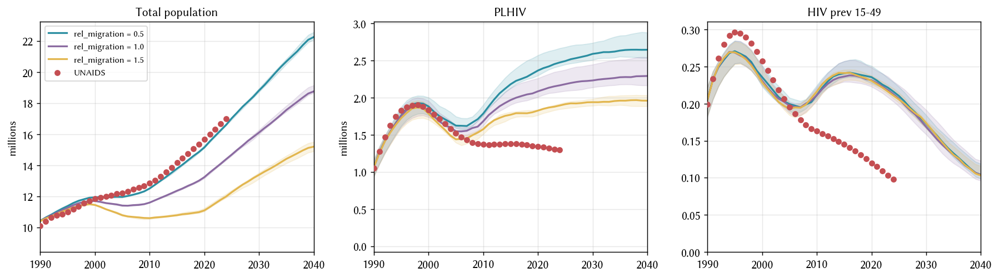

# Exp 03 — Pin `rel_migration` at a point value

**Date:** 2026-07-14.

**Question.** What single value of `rel_migration` (all other model
parameters held fixed at prior midpoints) tracks UNAIDS `n_alive` most
closely for Zimbabwe 1990-2024?

**Result.** `rel_migration = 0.5`. Locks the sim's population trajectory
within ~3% of UNAIDS at every survey year (12.51 M vs 12.84 M in 2010;
15.14 M vs 15.67 M in 2020; 16.60 M vs 16.99 M in 2024). Also uncovered
a bug: `apply_calib_pars` in `model.py` was silently no-op'ing on all
demographics-module keys because `sim.pars.demographics = 'zimbabwe'`
(a string) at the point apply runs. Fixed by routing demographics
params through the `dem_pars` kwarg on `sti.Sim`.

## Scan results (median of K=5 seeds)

| year | UNAIDS n_alive (M) | rm=0.5 | rm=1.0 | rm=1.5 |
|---|---:|---:|---:|---:|
| 1990 | 10.11 | 10.42 | 10.41 | 10.40 |
| 2000 | 11.83 | 11.94 | 11.70 | 11.44 |
| 2010 | 12.84 | 12.51 | 11.60 | 10.60 |
| 2015 | 14.15 | 13.78 | 12.36 | 10.78 |
| 2020 | 15.67 | 15.14 | 13.23 | 11.09 |
| 2024 | 16.99 | 16.60 | 14.39 | 11.99 |

`rm=1.0` (data as-is) undershoots by 16% at 2020. `rm=1.5` fails badly
(29% undershoot). `rm=0.5` is the cleanest fit; residual ~3% at 2020
is small enough that HIV-mortality calibration should absorb it.

## Observations

### 1. The exp_02 "rel_migration is inert" finding was actually a routing bug

exp_02 reported near-zero correlation between per-draw `rel_migration`
and 2020 n_alive under a 50-draw LHS, and concluded that `rel_migration`
wasn't a useful calibration lever. That conclusion was based on a bug:
`apply_calib_pars` in `model.py` iterates over `sim.pars.demographics`
looking for module instances with matching `.name` — but pre-init that
attribute is still the location string `'zimbabwe'`, not a list of
modules, so no override ever landed. Every exp_02 draw silently ran
with the stisim default `rel_migration = 1.0`.

**Verification.** Building the sim with `calib_pars={'migration.rel_migration': X}`
for X ∈ {0.5, 1.0, 1.5}, initializing, and reading
`sim.demographics.migration.pars.rel_migration` returned `1.0`
regardless of X. After the fix, the same test returned `X` faithfully.
With that fix, exp_03's scan shows a clean monotonic relationship
between `rel_migration` and 2020 `n_alive` — as expected.

exp_02's SUMMARY.md is intentionally not amended (per the plugin's
immutability rule); this SUMMARY is the corrective record.

### 2. rel_migration is a coarse dial, not a smooth prior

Even though `rel_migration` now works, it's not obvious a full
calibration prior on it adds value. The 0.5 → 1.5 sweep here spans
a 4.6 M range on 2020 `n_alive` (11.09 to 15.14 M), so a wide prior
would let the calibration explore very different population sizes.
That's a lot of population-side variance that isn't the HIV question
we're trying to answer. Locking `rel_migration = 0.5` and calibrating
the 6 HIV / network priors against it keeps the HIV dial separate
from the demography dial.

### 3. Migration data itself isn't the problem, magnitude is

The Zimbabwe migration data table (from UN WPP) has decadal net-outflow
peaks around 2005 (-134k/yr) and 2015 (-162k/yr) that reflect real
crisis emigration. At `rel_migration = 1.0` the sim runs a much
steeper "dip" in n_alive around 2010 (11.60 M vs 12.84 M target) than
UN WPP itself shows. Halving those flows (rm=0.5) softens the dip
without changing its shape. This suggests the stisim Migration module's
implementation of outflows may be more aggressive than the UN WPP
totals would imply. Not something we need to fix in stisim — a scale
factor of 0.5 is a reasonable model-level correction.

### 4. HIV overshoot is now cleanly separable

With `rm=0.5` the population is tracking UNAIDS closely, so the ~35-40%
PLHIV overshoot in 2020 (2.5 M sim median vs 1.34 M UNAIDS) is no
longer confounded by a wrong denominator — it's a genuine "the sim's
HIV epidemic is running hot" signal that the 6-prior calibration
should address (mostly via `hiv.beta_m2f` and `structuredsexual` shape
priors).

## Next

1. Remove `migration.rel_migration` from `priors.py` (done as part of
   this experiment close).
2. Hardcode `rel_migration = 0.5` as the default in
   `model.py::make_sim`'s `dem_pars` (done).
3. Open `experiments/exp_04_coverage_after_migration_fix/` — rerun the
   50-draw coverage check on the 6 HIV / network priors, with
   `rel_migration = 0.5` baked in. Expand the plot to include ART
   coverage alongside new_infections and new_deaths — the three
   panels the researcher wants to interrogate for the epidemic
   dynamics.

## Artifacts

- `outputs/scan.parquet` — 15 sims (3 rm values × 5 seeds), annual
  n_alive / PLHIV / prev_15_49 / new_infections / new_deaths.
- `figures/rel_migration_scan.png` — 3-panel comparison against UNAIDS.
- `run.py`, `config.yaml`, `README.md` — experiment definition.

## Fix committed alongside close

`model.py` — introduced `DEM_MODULES = {'migration', 'pregnancy',
'deaths'}` and updated `make_sim` to extract those keys from
`calib_pars` and route them through `sti.Sim(dem_pars=...)`.
`priors.py` — dropped `migration.rel_migration`, leaving 6 calibration
priors.
