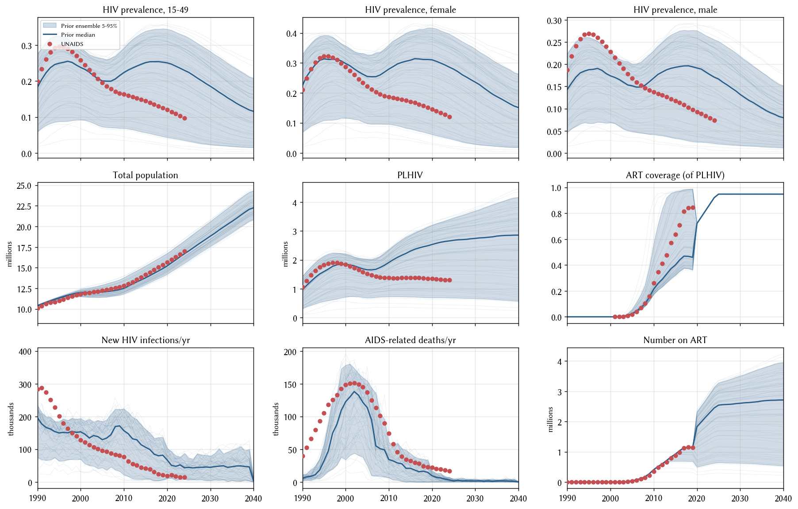

# Exp 04 — ART scale-up dynamics after fixing migration

**Date:** 2026-07-14.

**Question.** With `rel_migration = 0.5` locked (from
[exp_03](../exp_03_fix_migration/SUMMARY.md), population within 3% of
UNAIDS), does the sim reproduce the ART scale-up in the mid-2000s,
and does that scale-up bring new infections down as it should?

**Result.** The ART enrollment **mechanism** is intact — the sim's
`n_on_art` matches the forced `data/n_art.csv` schedule within
5–15% by 2010–2015. But the sim's HIV epidemic runs 2–4× too hot
across the ART scale-up window: new infections at 2010 are 157 k
(sim median) vs 76 k (UNAIDS), and PLHIV climbs from 1.9 M (2010)
to 2.5 M (2020) while UNAIDS has PLHIV plateauing at ~1.35 M. UNAIDS
still lies inside the ensemble at every year — the coverage check
passes formally — but 84 % of the variance in 2010 new_infections is
explained by one prior: `hiv.beta_m2f` (r = 0.92). The LHS median
β = 0.0225 is far too hot; only draws with β ≤ 0.010 track the
UNAIDS trajectory.

## Scorecard on the diagnostic panels

### ART scale-up mechanism (row 2 col 3, row 3 col 3)

Sim `n_on_art` vs forced `n_art` targets, median across 50 draws:

| year | data n_art | sim n_on_art | ratio |
|---:|---:|---:|---:|
| 2005 | 27 k | 40 k | 1.46 |
| 2010 | 356 k | 409 k | 1.15 |
| 2015 | 879 k | 921 k | 1.05 |
| 2020 | (forced ≥ 0.9 cov) | 1826 k | — |

Ratio converges to ~1.0 by 2015, so enrolment is on track from the
forced schedule. The 2005 overshoot is startup noise (very few people
were on ART yet, so any ramp-up over-shoots proportionally). **This
rules out "ART enrollment mechanism failure" as the cause of the
PLHIV overshoot.**

### PLHIV trajectory (row 2 col 2)

Sim PLHIV vs UNAIDS through the ART scale-up:

| year | UNAIDS PLHIV | sim median | delta |
|---:|---:|---:|---:|
| 2000 | 1.83 M | 1.84 M | +0.5 % |
| 2005 | 1.52 M | 1.66 M | +9 % |
| 2010 | 1.37 M | 1.91 M | +39 % |
| 2015 | 1.38 M | 2.30 M | +67 % |
| 2020 | 1.34 M | 2.53 M | +90 % |

In UNAIDS, PLHIV peaks around 2000 and drifts down. In the sim,
PLHIV bottoms briefly at 2005–2007 and then **climbs** through 2020.
The divergence begins exactly when ART is scaling up — i.e. ART
enrollment is happening but not fast enough to overcome incoming
new infections.

### New infections (row 3 col 1)

The sim's new infections don't fall the way UNAIDS's do:

| year | UNAIDS | sim median | sim / UNAIDS |
|---:|---:|---:|---:|
| 2000 | 129 k | 153 k | 1.19 |
| 2005 | 96 k | 129 k | 1.35 |
| 2010 | 76 k | 157 k | 2.06 |
| 2015 | 42 k | 106 k | 2.53 |
| 2020 | 18 k | 67 k | 3.68 |

**Between 2005 and 2010, ART enrollment goes from 40 k → 409 k in the
sim** (10× scale-up), yet **new infections increase** from 129 → 157 k.
UNAIDS-real-world sees new infections fall from 96 → 76 k over the
same window.

## Diagnosis

### 1. Coverage passes, calibration fit doesn't

Every UNAIDS target is inside the ensemble 5–95 % envelope. Formally
coverage passes. But the median trajectory is nowhere near UNAIDS in
the 2010+ window — the ensemble is bracketing the target only because
its spread is wide.

### 2. β_m2f explains almost all the variance

Correlation of `hiv.beta_m2f` with 2010 new_infections across draws:
**r = 0.92**. The 5 draws with the lowest 2010 new_infections all
have `β_m2f ≤ 0.010`. The LHS median is 0.0225, and only 16 % of
draws hit the 2020 new_infections target from below.

### 3. Prior widening is not the right move

exp_02 widened β_m2f upper to 0.04 to catch marginal endpoint misses.
With population now correctly tracked, that widening looks like
chasing a symptom — the correct move is probably a *tighter* β_m2f
range (e.g. [0.005, 0.015]) reflecting where good draws actually
live. Wide β floods the LHS with runaway-epidemic draws that never
match data no matter how ART scales up.

### 4. ART is doing what ART should — the numerator is fine, the denominator is inflated

If the sim's β were correctly calibrated so PLHIV = 1.35 M at 2020
(matching UNAIDS), then 1826 k on ART on top of 1.35 M PLHIV would
be nonsensical (> 100 % coverage). So the "sim runs coverage" figure
we plot is really just "sim runs enough ART enrollments to hit the
forced numerator, but the denominator is 2× too big". Any perceived
ART-coverage gap is a β problem, not an ART problem.

## Next

Deferred pending review. Findings put on the table for the researcher:

- The model + forced ART schedule reproduces enrollment correctly.
- Under the current LHS prior, the median β is much too hot; the
  useful β range is a subset of the prior.
- All targets pass formal coverage but the ensemble median misses
  by 2–4× on infections and PLHIV.
- A tighter β prior probably resolves this at calibration time; but
  the researcher may want to inspect whether other structural issues
  are at play (natural-history transitions, on-ART protection
  effectiveness, network dynamics driving continued transmission).

## Artifacts

- `outputs/coverage_check.parquet` — 50 draws × 56 years × 9 result
  columns (adds `hiv.n_on_art`, `hiv.p_on_art` to the exp_02 set).
- `outputs/coverage_draws.csv` — LHS design (6 priors).
- `figures/coverage_check.png` — 3×3 diagnostic figure.
- `run.py`, `config.yaml`, `README.md` — experiment definition.
