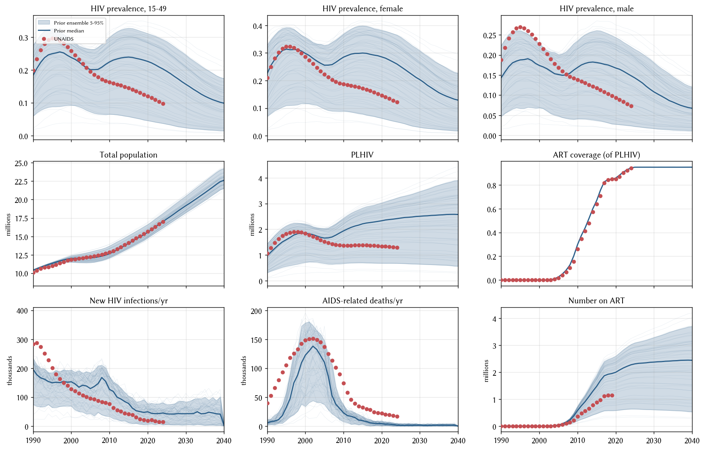

# Exp 05 — ART intervention driven by p_art (coverage) instead of n_art

**Date:** 2026-07-14.

**Question.** Does switching the ART intervention from absolute
enrollment (`n_art`) to coverage-based (`p_art` = fraction of PLHIV
on ART) give the sim a self-correcting feedback loop that closes the
PLHIV overshoot from [exp_04](../exp_04_coverage_after_migration_fix/SUMMARY.md)?

**Result.** Directional improvement on new_infections and PLHIV, but
modest. The switch works mechanically (ART coverage panel visibly
climbs 2005-2020 tracking the input curve), and it does what we
expected — as sim PLHIV inflates, coverage-based enrollment puts
more people on treatment, blocking more onward transmission. But
the improvement is ~20-25% on new_infections and only ~8% on 2020
PLHIV: the sim still runs 1.7× the UNAIDS PLHIV and 2.7× the UNAIDS
new_infections at 2020. Meanwhile new_deaths went the *wrong* way
(0.43× → 0.20× at 2020) as more ART-treated agents avoid death.
That last observation surfaces a deeper problem: **the sim was
already undershooting deaths in the pre-ART years too** (0.83× at
1990-2000), pointing at HIV natural history (dur_untreated too long)
as the compounding driver of PLHIV overshoot.

## Scorecard: exp_04 (n_art) vs exp_05 (p_art)

Ensemble median as ratio to UNAIDS:

| year | metric | exp_04 | exp_05 | Δ |
|---:|---|---:|---:|---:|
| 2000 | PLHIV | 1.00 | 1.00 | — |
| 2010 | PLHIV | 1.39 | 1.41 | +0.02 (worse) |
| 2015 | PLHIV | 1.67 | 1.60 | −0.07 |
| 2020 | PLHIV | 1.89 | 1.74 | −0.15 |
| 2010 | new_infections | 2.05 | 1.66 | −0.39 |
| 2015 | new_infections | 2.53 | 1.86 | −0.67 |
| 2020 | new_infections | 3.69 | 2.72 | −0.97 |
| 2010 | new_deaths | 0.46 | 0.31 | −0.15 (worse) |
| 2015 | new_deaths | 0.64 | 0.29 | −0.35 (worse) |
| 2020 | new_deaths | 0.43 | 0.20 | −0.23 (worse) |

## Observations

### 1. The self-correcting feedback loop works — just not enough

Coverage-based enrollment does what its logic promises: as sim PLHIV
inflates, more people get on ART, transmission drops. Between exp_04
and exp_05, 2020 new_infections drops from 3.69× → 2.72× UNAIDS
while PLHIV drops 1.89× → 1.74×. But β is far enough above the good
value that even 95% coverage among an inflated PLHIV pool doesn't
bring transmission down to UNAIDS's level.

### 2. p_art is the correct default going forward regardless of what else changes

Even setting aside the calibration outcome, `p_art` is the more
defensible parameterisation: it matches how UNAIDS itself reports
ART coverage, and it means the model's ART programme doesn't
mechanically produce nonsense (like 130% coverage) if PLHIV is
mis-calibrated. Adopt as the default. [Done in the exp_05 commit.]

### 3. The new_deaths structural issue is now the leading finding

Ratio of sim median to UNAIDS across experiments:

| year | exp_01 | exp_04 | exp_05 |
|---:|---:|---:|---:|
| 1990 | 0.36 | 0.13 | 0.13 |
| 2000 | — | 0.65 | 0.83 |
| 2010 | 0.31 | 0.46 | 0.31 |
| 2020 | 0.24 | 0.43 | 0.20 |

Even in 1990 — pre-ART, before any of the changes we've made this
week could affect things — sim new_deaths runs at 13-36% of UNAIDS.
This is a natural-history problem. Candidate root causes:

- `hiv.dur_untreated` (time from acute → AIDS death) too long,
  producing more prevalent PLHIV who never die.
- `hiv.rel_death_rate_untreated` (or equivalent) too low.
- Death events happening but a definition mismatch on the target
  side (UNAIDS "AIDS-related" is broad and includes TB/OI
  co-mortality that stisim may not classify as AIDS death).

Fixing natural history reduces PLHIV via the numerator (more deaths)
which is the compounding force on the transmission overshoot.

### 4. β is still the primary transmission dial and remains too high

r = 0.92 correlation between prior-sampled β_m2f and 2010 new_infections
carried over from exp_04. Coverage-based ART cuts the median 2020
new_infections from 3.69× → 2.72× UNAIDS but leaves the fundamental
prior-median-too-hot problem unresolved. Next experiment (exp_06)
tests whether pushing condom use up from 2005 onwards can compensate
without a β cut.

## Next

[exp_06_condom_scale_up](../exp_06_condom_scale_up/) — push condom
use higher from 2005 onwards in the cross-risk partnerships (which
currently plateau at 0.70 from 2005-2015). Test whether this
mechanism-consistent change (matches Zimbabwe's real ABC / behaviour
change campaign) closes the transmission overshoot without needing
a β cut. Compare "current" / "modest bump" / "aggressive bump"
schedules side-by-side.

Deferred: natural-history levers (dur_untreated) — likely needed
too, but should be tested independently to avoid confounding.

## Artifacts

- `outputs/coverage_check.parquet` — 50 draws × 56 years × 9 result
  columns.
- `outputs/coverage_draws.csv` — LHS design.
- `figures/coverage_check.png` — 3×3 diagnostic.
- `run.py`, `config.yaml`, `README.md` — experiment definition.
- **Repo-level changes committed alongside exp_05:**
  `data/p_art.csv` (new), `hiv_model.py::make_hiv_intvs` (uses p_art).
