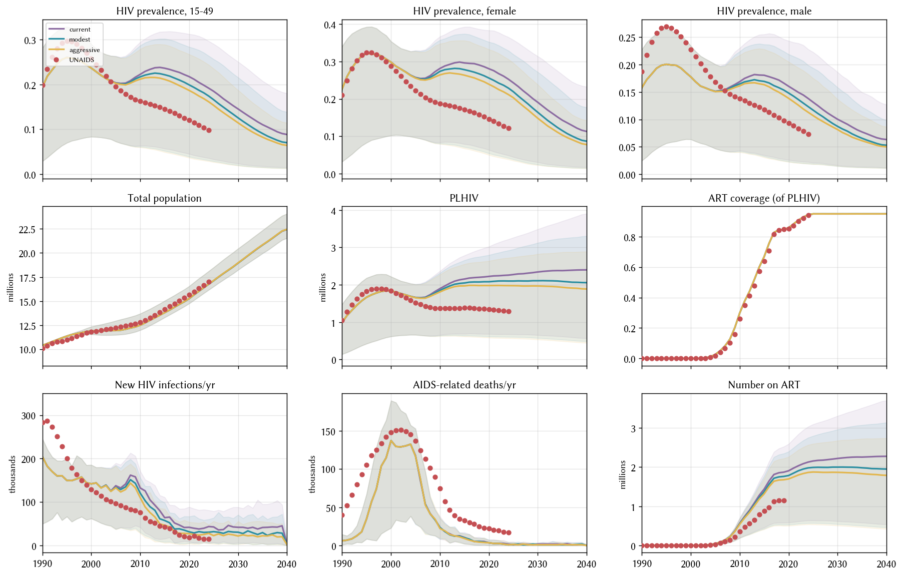

# Exp 06 — Condom-use scale-up scenarios

**Date:** 2026-07-14.

**Question.** Does pushing condom use UP from 2005 onwards (matching
Zimbabwe's real ABC / behaviour-change campaign) close the exp_05
transmission overshoot without any β change?

**Result.** Condom scale-up cuts 2020 new_infections from
[exp_05](../exp_05_art_by_coverage/SUMMARY.md)'s 2.72× UNAIDS to
**1.48×** under the aggressive schedule — closes ~half the gap on
transmission. PLHIV improvement is more modest (1.74× → 1.49×). Zero
effect on new_deaths (remains 0.16× UNAIDS across all three
scenarios) — condoms prevent onward transmission, not death of
already-infected agents. The remaining hot signal points at
**treatment churn**, not more condom pushing. Diagnostic run after
this experiment showed that **21-29% of PLHIV in 2010-2015 are in
the `post_art` state** (transmitting at full rate) because
`dur_on_art` defaults to a 3-year mean that doesn't reflect lifelong
ART retention. exp_07 will scan `dur_on_art`.

## Scorecard: median across 30 draws vs UNAIDS

| year | metric | UNAIDS | current | modest | aggressive |
|---:|---|---:|---:|---:|---:|
| 2020 | PLHIV | 1.34 M | 2.2 M (1.64×) | 2.1 M (1.57×) | 2.0 M (**1.49×**) |
| 2020 | new_inf | 18 k | 42 k (2.29×) | 31 k (1.71×) | 27 k (**1.48×**) |
| 2015 | new_inf | 42 k | 64 k | 57 k | **47 k (1.11×)** |
| 2020 | new_deaths | 22 k | 3.5 k | 3.5 k | 3.5 k (**0.16×**) |
| 2020 | prev_15_49 | 12.0% | 21.7% | 19.9% | 18.7% |

## Observations

### 1. Condom scale-up bites, but plateaus

Going from current schedule to aggressive schedule cuts 2020
new_infections by ~35%. Going further (higher than aggressive) would
push condom use to unrealistic levels (>95% in cross-risk
partnerships) with diminishing returns.

### 2. New_deaths is condom-invariant

All three scenarios produce the same new_deaths trajectory. This is
mechanistically correct — condoms only affect onward transmission,
not the fate of already-infected agents. But it confirms new_deaths
is a *different problem* from new_infections, needing a different
lever.

### 3. Post-experiment diagnostic surfaced the treatment-churn problem

Single-sim diagnostic at 2010-2015 shows:

- PLHIV: ~2 M
- On ART: 30-67% of PLHIV
- **Post-ART (transmitting at 100%): 21-29% of PLHIV**
- Never-ART: 12-41%

The post-ART fraction is huge because `dur_on_art` defaults to
LogN(mean=3 yr). Real Zimbabwe ART retention (Bygrave 2011,
Fatti 2010): 85% at 3 yr, 70% at 5 yr, 55% at 10 yr — pointing to
a lifetime mean of 15+ years.

## Next

`experiments/exp_07_dur_on_art_scan/` — point-value scan of
`hiv.dur_on_art` mean at {3, 10, 20} years, other priors at
midpoints, K=5 seeds per value. Verifies how much of the transmission
gap treatment churn accounts for before we widen or fix the prior.

## Artifacts

- `outputs/condom_scale_up.parquet` — 3 scenarios × 30 draws × 56
  years × 9 result columns.
- `outputs/draws.csv` — paired LHS design.
- `figures/condom_scale_up.png` — 3×3 diagnostic with three-scenario
  overlay.

## Repo-level changes committed alongside exp_06

- `model.py::make_sim` now accepts a `condom_data=None` kwarg so
  runners can pass alternative condom schedules without touching the
  CSV on disk.
