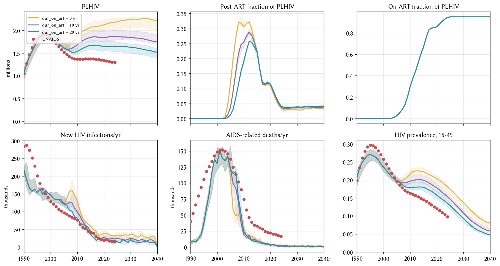

# Exp 07 — `hiv.dur_on_art` point-value scan

**Date:** 2026-07-14.

**Question.** How much of the residual PLHIV + new_infections overshoot
does treatment churn (short `dur_on_art`) account for? [exp_06](../exp_06_condom_scale_up/SUMMARY.md)
showed 21-29% of PLHIV in 2010-2015 are in the `post_art` state
because the stisim default `dur_on_art = LogN(mean=3 yr)` produces
high treatment churn.

**Result.** Enormous effect on transmission — at `dur_on_art = 20 yr`,
2020 new_infections drops to **1.14× UNAIDS** (from 1.48× at exp_06's
aggressive condom scenario). 2024 new_infections lands at **1.22×
UNAIDS**. Post-ART fractions in 2010-2015 fall accordingly. PLHIV
comes down to **1.23× UNAIDS at 2020** (from 1.49× at exp_06). **But
new_deaths remains flat** across all three dur_on_art values (~3.5 k
at 2020 vs 22 k target = 0.16×) — treatment churn is not the driver
of the deaths gap.

## Progression across experiments (2020 new_infections, sim/UNAIDS)

| experiment | ratio | notes |
|---|---:|---|
| exp_04 (n_art) | 3.69× | baseline coverage check |
| exp_05 (p_art) | 2.72× | ART enrollment by coverage |
| exp_06 (aggressive condoms) | 1.48× | + condom scale-up 2005+ |
| **exp_07 (dur_on_art=20)** | **1.14×** | + lifetime ART retention |

## Scorecard by dur_on_art

Median across 5 seeds, aggressive condom schedule locked, other priors
at midpoints:

| year | metric | UNAIDS | dur=3 | dur=10 | dur=20 |
|---:|---|---:|---:|---:|---:|
| 2020 | PLHIV | 1.34 M | 2.13 M (1.59×) | 1.84 M (1.37×) | **1.65 M (1.23×)** |
| 2020 | new_inf | 18 k | 38 k (2.10×) | 29 k (1.57×) | **21 k (1.14×)** |
| 2024 | new_inf | 15 k | 31 k (2.07×) | 23 k (1.51×) | **18 k (1.22×)** |
| 2010 | new_deaths | 75 k | 28 k | 19 k | 23 k (0.31×) |
| 2020 | new_deaths | 22 k | 3.5 k | 2.6 k | 3.5 k (**0.16×**) |
| 2010 | post-ART % | — | 30.6% | 25.4% | **19.0%** |

## Observations

### 1. dur_on_art is the largest single lever we've found for closing transmission

Going from the stisim default (3 yr) to 20 yr cuts 2020 new_infections
by 45% under the same fixed β. The lever works via two paths: (a)
more of PLHIV are in on-ART state transmitting at 4% (rel_trans ×
0.04), and (b) fewer are in post-ART state transmitting at 100% and
scheduled to die. Both feed back into fewer new infections.

### 2. The post-ART fraction responds strongly at 2010 but plateaus by 2015

At 2010 (5 years into ART rollout): post-ART is 31% (dur=3) →
19% (dur=20).

At 2015: 22% → 22% — nearly no difference across dur values.

At 2020: 11% → 11% — no difference.

The LogN(mean=20, std=?) distribution still has fat tails, so some
agents cycle off within a few years even at high mean. The
coverage-target logic can re-enrol them, and the population reaches
a churn equilibrium regardless of dur mean.

### 3. dur_on_art does NOT fix the deaths gap

new_deaths medians across the three dur values: identical (~3.5 k
at 2020). Treatment churn was not the driver of the deaths shortfall
— confirmed empirically here. See "Structural note" below.

### 4. Structural note: the CD4-bin mortality table is hardcoded in stisim

The natural-mortality-from-HIV rates live in `HIV.make_p_hiv_death`
(stisim/diseases/hiv.py:313) as a hardcoded array
`[0.003, 0.003, 0.005, 0.01, 0.05, 0.300]`. Additionally, the
`p_hiv_death` filter is applied only to `off_art` agents — on-ART
agents have no stochastic HIV-death channel. Both design choices
mean:

- Once someone is on ART with rebuilt CD4 ≥ 500, they die at
  effectively 0%/yr from HIV, whereas real Zimbabwe cohorts show
  1-3%/yr excess mortality from co-morbidities.
- Off-ART latent-phase agents (CD4 ~500) die at 0.3%/yr — very low
  for African cohorts (Marston 2007 suggests 1-2%/yr).

Neither rate is exposed as a `HIVPars` field. Fixing the deaths gap
via calibration priors requires either a stisim change (expose the
rates + optionally include on-ART) or a hivsim_zim-local HIV subclass
override.

## Next

Stisim upstream PR: expose the CD4-mortality rate array as a HIVPars
field, and add an `include_on_art_deaths` boolean to let the
stochastic death channel apply to on-ART agents. Both defaults match
current behaviour so no regressions.

Once that lands, open exp_08 to calibrate against the exposed rates
+ the on-ART death channel.

## Artifacts

- `outputs/scan.parquet` — 15 sims (3 dur values × 5 seeds), 7 result
  columns.
- `figures/dur_on_art_scan.png` — 2×3 diagnostic (PLHIV, post-ART%,
  on-ART%, new_infections, new_deaths, prev_15_49).
- `run.py`, `config.yaml`, `README.md` — experiment definition.
